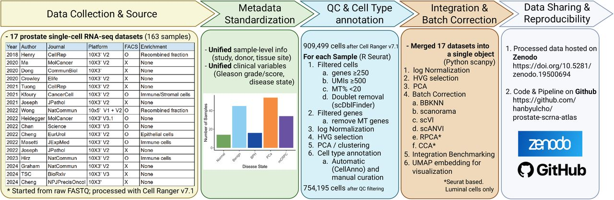
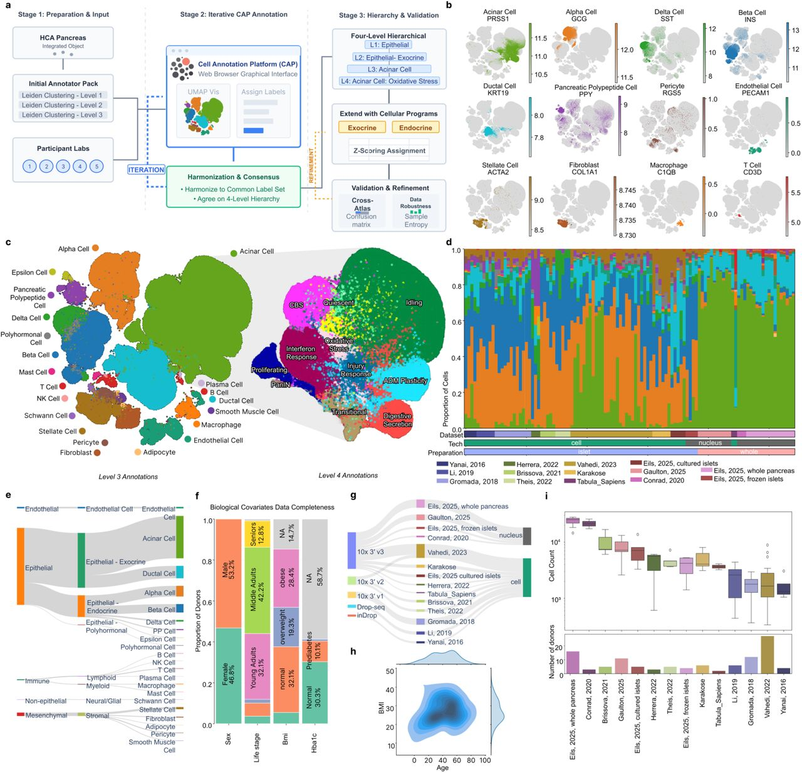
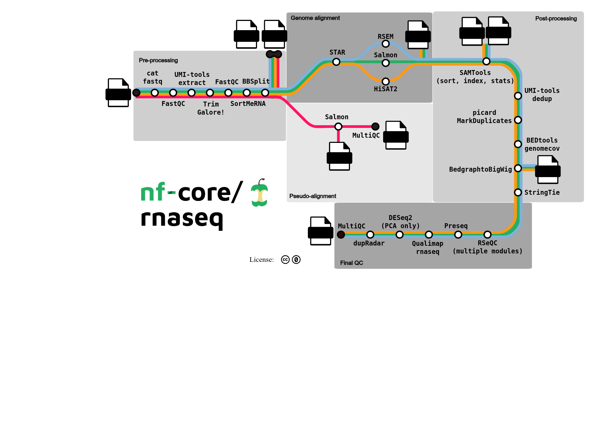

# Datasets description for the construction of the consensus single-cell transcriptomic atlas

@tbl-sc-atlases summarises published single-cell and spatial transcriptomic atlases relevant to gastrulation, organoid, and related developmental models, including public dataset access and code repositories where available.

Rows are drawn from `data/gastruloid_and_atlas_merged.csv` where `catalogue == "atlas"`.

The Pijuan-Sala mouse gastrulation map [@pijuan2019] is also available as a Bioconductor
`MouseGastrulationData` object for annotating observed cell types in gastruloids
[@mousegastrulationdata].

| Title | Authors | DOI | Year | Journal | Species | Study type | Bulk transcriptomics | Single-cell transcriptomics | Imaging | Spatial transcriptomics | Spatial proteomics | ChIP-seq | Metabolomics | Proteomics | Lineage barcoding | Time points (days) | Tissues | Summary | Public links |
|---|---|---|---:|---|---|---|---|---|---|---|---|---|---|---|---|---|---|---|---|
| A spatiotemporal atlas of mouse gastrulation and early organogenesis to explore axial patterning and project in vitro models onto in vivo space |  | [10.1016/j.celrep.2025.116047](https://doi.org/10.1016/j.celrep.2025.116047) | 2025 | Cell Reports | Mouse | primary | ❌ | ✅ | ❌ | ✅ | ❌ | ❌ | ❌ | ❌ | ❌ | Gastrulation to early organogenesis (embryonic-day axis; see article) | Whole embryo; axial patterning; mesoderm; neural; endoderm | Spatiotemporal mouse gastrulation atlas integrating spatial transcriptomics with scRNA-seq for in vitro projection. | https://doi.org/10.1016/j.celrep.2025.116047 |
| An integrated transcriptomic cell atlas of human endoderm-derived organoids | Xu, Q.; Camp, J.G. | [10.1038/s41588-025-02182-6](https://doi.org/10.1038/s41588-025-02182-6) | 2025 | Nature Genetics | Human | primary | ❌ | ✅ | ❌ | ❌ | ❌ | ❌ | ❌ | ❌ | ❌ | Multi-protocol meta-atlas (variable culture ages across source studies) | Endoderm; lung; intestine; liver; biliary; stomach; pancreas; prostate | HEOCA (~1M cells) integrates endoderm organoid sc/snRNA-seq to assess protocol fidelity vs primary tissues. | CELLxGENE HEOCA; GSE287233; Zenodo 10.5281/zenodo.8181495; https://github.com/devsystemslab/HEOCA |
| An integrated transcriptomic cell atlas of human neural organoids | He, Z.; Treutlein, B. | [10.1038/s41586-024-08172-8](https://doi.org/10.1038/s41586-024-08172-8) | 2024 | Nature | Human | primary | ❌ | ✅ | ❌ | ❌ | ❌ | ❌ | ❌ | ❌ | ❌ | Multi-protocol meta-atlas (~7–450 culture days across source studies) | Neural; brain organoids | HNOCA (>1.7M cells; 26 protocols) maps neural organoid coverage vs developing brain references. | CELLxGENE HNOCA; Zenodo 10.5281/zenodo.11203684; https://github.com/devsystemslab/HNOCA-tools |
| Single-cell and spatial transcriptomics reveal somitogenesis in gastruloids | van den Brink, S.C.; van Oudenaarden, A. | [10.1038/s41586-020-2024-3](https://doi.org/10.1038/s41586-020-2024-3) | 2020 | Nature | Mouse | primary | ❌ | ✅ | ✅ | ✅ | ❌ | ❌ | ❌ | ❌ | ❌ | ~2–5 (gastruloid culture days; tomo-seq mainly at ~120 h / day 5) | NMP; somite/presomitic mesoderm; neural; endoderm; mesoderm | Gastruloid–embryo scRNA-seq + tomo-seq atlas of somitogenesis and A–P organisation. | GSE123187; https://avolab.hubrecht.eu/MouseGastruloids2020; GitHub anna-alemany/vincentvbatenburg |
| A single-cell molecular map of mouse gastrulation and early organogenesis | Pijuan-Sala, B.; Marioni, J.C. | [10.1038/s41586-019-0933-9](https://doi.org/10.1038/s41586-019-0933-9) | 2019 | Nature | Mouse | primary | ❌ | ✅ | ❌ | ❌ | ❌ | ❌ | ❌ | ❌ | ❌ | E6.5–E8.5 (~embryonic days; 9 sequential collections) | Whole embryo; pluripotent epiblast; mesoderm; endoderm; ectoderm | In vivo molecular roadmap of lineage diversification during mouse gastrulation (~116k cells). | E-MTAB-6967; Bioconductor MouseGastrulationData; https://marionilab.cruk.cam.ac.uk/MouseGastrulation2018/; https://github.com/MarioniLab/EmbryoTimecourse2018 |

: Single-cell and spatial transcriptomic atlases and public access links {#tbl-sc-atlases}

# Related atlas construction: prostate and pancreas references

Beyond gastrulation/organoid atlases, recent **tissue-scale** atlas projects are useful
comparators for integration design. @tbl-related-atlases summarises two preprints that
document harmonisation, batch correction and annotation choices in detail—one prostate
cancer atlas [@cho2026prostate] and one healthy **pancreas** reference
[@parikh2026pancreas].

| Atlas | Authors | DOI | Year | Scope | Cells / studies | Integration & annotation highlights |
|---|---|---|---:|---|---|---|
| Harmonized prostate cancer / benign scRNA-seq atlas | Cho, H.; Zhang, Y. | [10.64898/2026.05.18.725966](https://doi.org/10.64898/2026.05.18.725966) | 2026 | Localised + metastatic prostate cancers and benign tissues | 17 studies; 163 donors; 17 cell types | Multiple **integration-strategy benchmarks** across batches [@cho2026prostate] |
| Human Pancreas Cell Atlas (healthy reference) | Parikh, S.; Strobl, D.C. | [10.64898/2026.06.22.733853](https://doi.org/10.64898/2026.06.22.733853) | 2026 | Healthy pancreas for disease contextualisation | Multi-study healthy reference | Re-process FASTQs to a current human genome when counts missing; **scANVI** after HVG selection; semi-supervised labels via HCA CAP; disease-survival cell-type links [@parikh2026pancreas] |

: Related tissue atlases used as construction comparators {#tbl-related-atlases}

{#fig-prostate-atlas}

{#fig-pancreas-atlas}

# Visualising pipelines with MetroFlow

[MetroFlow](https://gitlab.liris.cnrs.fr/sharefair/bioflow-insight/-/tree/v2.0.12)
(BioFlow-Insight) is a **Nextflow-like workflow visualisation** tool: it renders
pipeline DAGs as metro-map / transit schematics, which helps compare atlas
construction graphs (ingest → QC → HVG → integration → annotation → trajectories)
across projects [@metroflow].

{#fig-metroflow}

# Standard pipeline for integrating multiple single-cell datasets

1. Metadata curation and harmonisation
   - [`sfaira`](https://sfaira.readthedocs.io/en/latest/adding_datasets.html)
     for dataset management and storage of single-cell collections

2. Common feature space
   - Restrict to protein-coding genes, or exclude long non-coding RNAs as
     appropriate for the atlas design

3. Cell selection
   - Hard thresholds on mitochondrial content and percentage of expressed genes;
     also remove cells with **low ribosomal content**
   - Doublet removal (not always done in Fabian’s atlas papers)

4. Normalisation / transformation
   - Selection of HVGs (highly variable genes)
   - Transformation variants of log-normalisation: logCPM, TPM, `ScTransform`, VST

5. Data integration across batches (batch-effect removal)
   - Non-integrated projection:
     - PCA + selection of most contributing features
     - Alternatives: kNN + UMAP; Leiden clustering
   - Projection onto a *reference atlas* using RSS (reference similarity spectrum;
     related to MDS), followed by bipartite weighted kNN and UMAP
   - Cell-type annotation:
     - `Snapseed`: marker-based + hierarchical labelling (three levels)
   - **Label-aware** integration:
     - `scPoli`: conditional VAE for batch correction / semi-supervised granular
       strategy; embeds batch in its own latent space (e.g. 5-D in the neural atlas)

6. Pseudotime inference and **cell trajectories**
   - **Pseudotime inference** — assign each cell a position along a continuous
     progression axis
     - Example: `moscot` uses optimal transport (time and/or spatial) to couple
       populations across time points; the **cost function** accounts for death,
       differentiation and birth
   - **Trajectory reconstruction / lineage graph inference** — reconstruct the
     most likely graph or tree of branching lineages / cell-type transitions
     - Examples: `CellRank`, `scVelo`, `Palantir`, `FateID`, `URD`, …
   - GPCCA (Generalized Perron Cluster Cluster Analysis): identifies
     **macro-states** (sources/roots), transient manifolds (branch points /
     internal nodes), and **terminal states** (absorbing attractors / leaves),
     via branched Schur decomposition
   - Open question: how do pseudotime tools and GPCCA-style macro-state
     decompositions interplay in practice?

## References
