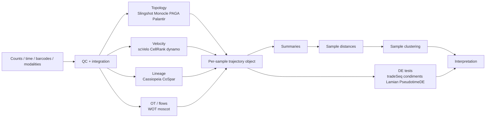

# Overview

Cluster **samples** (organoids, donors, patients), not cells, by comparing estimated
trajectory objects: topology, pseudotime composition, clone dynamics, and
velocity or optimal-transport (OT) flows
[@saelens2019; @condiments2024; @lamian2023; @wot2019].
A shared manifold → trajectories or couplings → sample-specific deviations →
sample–sample distances is more interpretable than clustering on UMAP alone
[@saelens2019; @tumap2022; @cellalign].

**Backbones.** Pseudotime/topology: Slingshot, Monocle, Palantir, PAGA
[@slingshot; @monocle; @palantir; @saelens2019].
Directed flows: scVelo, CellRank, dynamo [@scvelo; @cellrank; @dynamo2022].
Temporal couplings: Waddington-OT, LineageOT, CoSpar, moscot
[@wot2019; @cospar; @ot_primer2024].
These estimate different objects (ordering, graph, Markov operator, OT coupling);
do not treat them as interchangeable [@saelens2019; @bergen2021; @ding2022].

**Differential testing.** tradeSeq (NB-GAMs), condiments, Lamian, and
PseudotimeDE (uncertainty-aware nulls)
[@tradeseq; @condiments2024; @lamian2023; @pseudotimede].

**Sample clustering.** Align trajectories, then combine topology, progression,
composition, clone and velocity distances; cluster with hierarchical or graph
methods and bootstrap/permutation stability
[@cellalign; @capital2024; @tumap2022; @ot_primer2024].

The main gap is the lack of end-to-end sample clustering with joint lineage,
velocity and multimodal uncertainty [@taheriyoun2026; @bergen2021; @ding2022].

# Data structures

For sample $s$, observe counts $Y_s$, times $t_{sm}$, embeddings $x_{si}$,
pseudotime $\tau_{si}$, lineage weights $w_{si\ell}$, optional barcodes $b_{si}$
and velocities $v_{si}$. Cells are destroyed on measurement, so time-courses are
unpaired [@wot2019; @ding2022; @multivelo].

Three clocks must not be conflated: **experimental time**, **pseudotime**, and
**velocity** (local direction). Represent each sample as

$$
\mathcal{T}_s =
\big(
\Gamma_s,\;
p_s(\tau,\ell),\;
c_s(\tau),\;
v_s(x),\;
\Pi_s,\;
\mathcal{L}_s
\big)
$$ {#eq-trajectory-object}

where $\Gamma_s$ is topology, $p_s$ density along pseudotime/lineage, $c_s$ clone
or composition dynamics, $v_s$ a velocity field, $\Pi_s$ a coupling/Markov
operator, and $\mathcal{L}_s$ a lineage tree [@slingshot; @cellrank; @wot2019;
@cospar; @cassiopeia]. Cluster on the components relevant to the question.

# Trajectory inference and testing

## Method families

- **Pseudotime / topology** — Slingshot, Monocle 3, Palantir, PAGA
  [@slingshot; @monocle; @palantir; @saelens2019].
- **Velocity / fate** — scVelo (dynamical splicing), CellRank (Markov fates),
  dynamo (vector fields) [@scvelo; @cellrank; @dynamo2022; @bergen2021].
- **OT / flows** — Waddington-OT, TrajectoryNet, moscot (atlas-scale couplings)
  [@wot2019; @ot_primer2024].
- **Lineage / barcodes** — Cassiopeia, LineageOT, CoSpar
  [@cassiopeia; @cospar; @zwaans2025].
- **Multimodal dynamics** — MultiVelo (RNA + chromatin) [@multivelo].

## Differential models

Gene-level NB-GAM along pseudotime and lineage [@tradeseq]:

$$
Y_{ig} \sim \mathrm{NB}(\mu_{ig},\theta_g),\quad
\log\mu_{ig}
=
\log o_i
+ \sum_{\ell} w_{i\ell}\, f_{g\ell}(\tau_i)
+ \beta_g^\top z_i
$$ {#eq-tradeseq}

With replicates, prefer mixed effects / multi-sample curves
[@lamian2023; @condiments2024]:

$$
\log\mu_{isg}
=
\log o_{is}
+ f_g(\tau_{is},\mathrm{condition}_s)
+ u_{sg},\quad
u_{sg}\sim\mathcal{N}(0,\sigma_g^2)
$$ {#eq-mixed}

For sample summaries $f_s(\tau)$ (state density, programme score, clone curve):

$$
f_s(\tau)
=
\mu(\tau)
+ \delta_{g(s)}(\tau)
+ u_s(\tau)
+ \varepsilon_s(\tau)
$$ {#eq-functional}

Align when rates differ but routes agree: cellAlign, CAPITAL, tuMap
[@cellalign; @capital2024; @tumap2022]. Continuous-state HMMs suit
low-dimensional temporal summaries [@cshmm2019; @taheriyoun2026].

Compositional cell-state or clone counts [@sccoda]:

$$
C_{sm}\sim\mathrm{Dirichlet\text{-}Multinomial}(N_{sm},\alpha_{sm}),\quad
\log\alpha_{smk}
=
\eta_{0k}+f_k(t_m)+\delta_{g(s),k}(t_m)
$$ {#eq-composition}

@tbl-method-families summarises the main families.

| Family | Target | Inputs | Lineage | Velocity | Sample clustering | Tools |
|---|---|---|---|---|---|---|
| Pseudotime / graph | Order, curves, topology | Counts / embeddings | Branching (not barcodes) | No | Upstream only | Slingshot, Monocle 3, Palantir, PAGA |
| NB-GAM DE | Gene smooths + tests | Counts, $\tau$, lineage weights | Via weights | No | No | tradeSeq |
| Multi-sample comparison | Progression, fate, topology | Shared trajectory, sample labels | Yes | Indirect | Features / distances | condiments, Lamian |
| Alignment | Rate / path warping | Trajectories | Tree-aware variants | No | Alignment distances | cellAlign, CAPITAL, tuMap |
| Velocity / Markov | Local directions, fates | Spliced/unspliced | Indirect | Yes | Fate / field summaries | scVelo, CellRank, dynamo |
| OT / flows | Couplings between distributions | Timepoints, embeddings | Lineage-aware variants | Optional | Coupling distances | WOT, moscot, LineageOT |
| Barcodes / trees | Phylogenies, clone maps | Barcodes + expression | Yes | Usually no | Clone-transition summaries | Cassiopeia, CoSpar |
| Multimodal dynamics | Joint RNA–chromatin timing | RNA + ATAC (etc.) | Yes | Yes | Indirect | MultiVelo |

: Trajectory and differential-dynamics method families {#tbl-method-families}

# Sample-level clustering

Define a sample distance [@tumap2022; @cellalign; @ot_primer2024]:

$$
D(s,s')
=
\lambda_1 d_{\mathrm{topology}}
+ \lambda_2 d_{\mathrm{progression}}
+ \lambda_3 d_{\mathrm{composition}}
+ \lambda_4 d_{\mathrm{clone}}
+ \lambda_5 d_{\mathrm{velocity}}
$$ {#eq-sample-distance}

**Default fingerprint.** Branch probabilities; pseudotime densities;
lineage-specific programme smooths; clone-size / transition summaries; CellRank
fates; coarse velocity (speed, terminal flux, transition entropy). Cluster on
this feature set; ablate terms to see what drives partitions
[@cellrank; @cospar; @wot2019].

**Distance families.** DTW / alignment if rates differ; tree/graph alignment if
branching differs (CAPITAL); Wasserstein if mass shifts between states
[@capital2024; @ot_primer2024; @wot2019].

**Velocity fields** after manifold registration:

$$
d_{\mathrm{velocity}}^2(s,s')
=
\int \big\|v_s(x)-v_{s'}\big(A(x)\big)\big\|^2 \rho(x)\,dx
$$ {#eq-velocity-distance}

or OT on $(x,v)$ pairs / local transition matrices [@scvelo; @dynamo2022;
@cellrank; @ot_primer2024]. No universal sample-level velocity metric yet
[@bergen2021].

**Clones.** Size trajectories, fate bias, diversification entropy, and
transition maps. CoSpar estimates a sparse coherent $T$ [@cospar]:

$$
\min_T \|T\|_1 + \alpha\|LT\|_2
\quad\text{s.t.}\quad
\|P(t_2)-P(t_1)T\|_2 \le \varepsilon,\; T\ge 0
$$ {#eq-cospar}

Compare $T$ across samples; with trees, add balance / depth / phylodynamic
summaries [@cassiopeia; @zwaans2025].

**Practical rule.** Prefer summary distances for cohort clustering; reserve
fully joint dynamical models for well-powered validation
[@saelens2019; @lamian2023; @taheriyoun2026].

# Pipeline and software

R/Bioconductor is strong for pseudotime testing (Slingshot, tradeSeq,
condiments); Python/scanpy for velocity and OT (scVelo, CellRank, WOT, moscot,
CoSpar) [@tradeseq; @scvelo; @cellrank; @wot2019; @ot_primer2024].

@tbl-recommended-tools lists a compact tool stack.

| Task | Tools | Role |
|---|---|---|
| Shared backbone | Slingshot; Monocle 3; PAGA; Palantir | Topology and pseudotime |
| Gene DE along $\tau$ | tradeSeq; PseudotimeDE | NB-GAM tests; uncertainty-aware nulls |
| Multi-sample comparison | condiments; Lamian | Progression, density, topology across samples |
| Velocity / fate | scVelo; CellRank; dynamo | Directed dynamics and fates |
| OT / temporal mapping | WOT; moscot | Couplings between timepoints |
| Lineage / clones | Cassiopeia; CoSpar | Trees and sparse transition maps |
| Multimodal dynamics | MultiVelo | Joint RNA–chromatin timing |

: Recommended tools by analysis task {#tbl-recommended-tools}

Use three summary layers for clustering: (i) topology/composition;
(ii) dynamics (smooths, fates, OT entropy, speed); (iii) ancestry when barcodes
exist. Prefer sample-level summaries over carrying full cell-level models into
clustering unless atlas-scale couplings are required [@taheriyoun2026;
@ot_primer2024].

# Statistical control and gaps

Propagate **pseudotime uncertainty** (PseudotimeDE); do not treat $\tau$ as known
[@pseudotimede; @tradeseq]. For multi-sample designs, permute **sample** labels,
not cells [@lamian2023; @condiments2024]. Power tracks number of biological
samples and branch coverage more than raw cell count.

Noise sources: overdispersion, dropout, batch, topology error, barcode
homoplasy, velocity misspecification [@tradeseq; @cospar; @bergen2021].

**Gaps.** No standard joint model of sample × lineage × multimodal state ×
velocity with calibrated uncertainty and direct sample clustering; no accepted
cross-sample velocity-field metric; lineage analyses still limited by incomplete
barcoding [@cassiopeia; @zwaans2025; @multivelo; @taheriyoun2026].

**Recommendation.** Shared dynamic backbone, preserve donor/sample structure,
compare aligned $\mathcal{T}_s$ (@eq-trajectory-object) rather than raw
embeddings, and treat lineage and velocity as complementary directional signals
[@saelens2019; @condiments2024; @lamian2023; @bergen2021].

# References {-}
