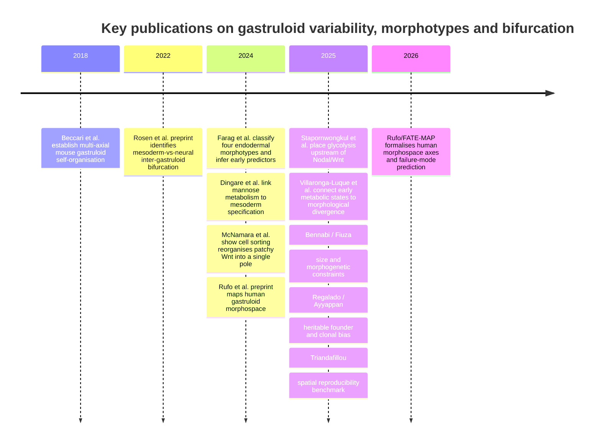

## Executive summary

The literature that directly targets **divergent outcomes emerging from nominally similar gastruloid starts** is still smaller than the broader gastruloid field, but it is now substantial enough to reveal a coherent picture. The strongest mouse study for this question is **Villaronga-Luque et al.** [@villaronga2025], because it links **individual morphological histories**, **time-resolved single-cell transcriptomes**, and **metabolic state** to later phenotypic divergence, and then tests causality by metabolic intervention. The key claim is that **early oxidative phosphorylation–glycolysis imbalance precedes and drives later aberrant morphology with a neural lineage bias**. Data are available at **GEO GSE250136**, with imaging and analysis deposits.

Across the direct and adjacent literature, proposed drivers of bifurcation fall into four recurring classes (@tbl-core-bifurcation; @tbl-adjacent-bifurcation):

1. **Metabolic state** — Luque, Dingare, Stapornwongkul [@villaronga2025; @dingare2024; @stapornwongkul2025].
2. **Signalling-state dynamics** (especially Wnt/Nodal/SOX2) — Rosen, Rufo, McNamara, Underhill [@rosen2022; @rufo2026; @mcnamara2024; @underhill2023].
3. **Physical or morphogenetic initial conditions** (density, size, elongation–lineage coordination) — Rufo, Bennabi, Fiuza, Farag [@rufo2026; @bennabi2025; @fiuza2025; @farag2024].
4. **Heritable founder-cell or clone bias** — Regalado, Ayyappan, and pre-culture epigenetic memory in Blotenburg [@regalado2025; @ayyappan2025; @blotenburg2025].

**No single paper yet closes the full causal chain** from founder-cell state, through live signalling and metabolism, to 3D morphogenetic divergence and terminal morphotype in the same individual gastruloids. **Luque comes closest**; Farag is strongest on **explicit morphotype classification**; Rufo on **phenotypic morphospace**; Regalado and Ayyappan on **intrinsic, heritable bias** [@villaronga2025; @farag2024; @rufo2026; @regalado2025; @ayyappan2025].

The highest-priority next step is a **prospective, single-gastruloid, multimodal bifurcation experiment** combining Luque-style paired morphology/molecular design with **lineage recording**, **live Wnt/Nodal/ERK reporters**, and systematic perturbation of **metabolism, density and size**, so relative causal weights and interactions can be estimated **before** visible divergence [@villaronga2025; @regalado2025; @rufo2026; @bennabi2025].

## Scope and inclusion logic

Here **“morphotype”** includes discrete morphological classes, structured regions of a low-dimensional phenotypic morphospace, and reproducible bifurcating trajectory classes that later produce distinct spatial or morphological outcomes. Papers were prioritised when their **main aim** was identifying morphotypes, mapping phenotypic landscapes, quantifying inter-gastruloid variability, defining failure modes, or testing drivers of divergent trajectories, ranked by closeness to **distinct outcomes from the same nominally naïve starting population**. Mechanistically informative papers that alter the start more strongly, or focus on patterning rather than divergence, are treated as adjacent.

The **Luque Villaronga** study remains the clearest attempt to join phenotype, dynamics, transcriptomics and metabolism in one framework [@villaronga2025]. Rufo exposes a human **12-cluster morphospace**; Farag a **decision-tree** for endodermal morphotypes; Luque the most reusable multi-modal entry point for reanalysis [@rufo2026; @farag2024; @villaronga2025].

## Prioritised literature

Read the field as a **core set** on divergence/morphotypes and a **second ring** of explanatory mechanism papers.

**Villaronga-Luque et al., *Cell Stem Cell* 2025** [@villaronga2025]. Mouse stem-cell embryo / TLS-like system; paired imaging, time-resolved scRNA-seq, metabolic interventions (**GSE250136**). Driver: early **OXPHOS–glycolysis imbalance** in NMP-like states predicting later neural-biased aberrant morphology. Evidence: **very strong** (time order + causal rescue). Limitation: final morphotype taxonomy needs full-text/data reanalysis.

**Farag et al., *Developmental Cell* 2024** [@farag2024]. Mouse gastruloids; live imaging; **500-tree** ensemble. **Four endodermal morphotypes** at 96 h, controlled by **coordination between endoderm progression and elongation**. Evidence: **very strong** for this sub-problem; limited to the endodermal branch.

**Rufo et al., *Nature Communications* 2026** (preprint 2024) [@rufo2026; @rufo2024preprint]. Human **2D** gastruloids; high-throughput perturbation; **12 clusters**; axes **cell-density-dependent Wnt** and **SOX2 stability**. Evidence: **very strong** morphospace map; limitation: 2D and largely perturbation-driven.

**Rosen et al., bioRxiv 2022** [@rosen2022]. Individual mouse gastruloids, MULTI-seq, days 3–5 (**GSE212050**). **Mesoderm- vs neural-biased** bifurcation with early **WNT-associated** activity difference. Evidence: **strongly suggestive**; correlative and preprint.

**Regalado et al., bioRxiv 2025** [@regalado2025]. Monoclonal gastruloids + **DNA Typewriter**. Heritable founder mESC state fluctuations bias trajectories. Evidence: **strong** on heritability; monoclonal design.

**Ayyappan et al., bioRxiv 2025** [@ayyappan2025]. Clonal propensities and **division of labour** among biased clones. Evidence: **strongly suggestive**; clone-centric.

**Triandafillou et al., bioRxiv 2025** [@triandafillou2025]. Spatial maps of **26** gastruloids; emphasises **reproducible organisation** (counterweight to heterogeneity narratives).

**Bennabi et al., *Science Advances* 2025** [@bennabi2025]. **System size** decouples morphogenetic timing from transcriptional programmes.

**Fiuza et al., *Cells & Development* 2025** [@fiuza2025]. **Mechanical/geometric constraints** and a robustness size window.

**Balayo et al., *Development* 2025** [@balayo2025]. Medium formulation (N2B27 vs NDiff227) shifts elongation and neural-vs-mesoderm bias.

**Blotenburg et al., *PLOS ONE* 2025** [@blotenburg2025]. Pre-culture pluripotency/epigenetic memory alters reproducibility and lineage composition.

**Adjacent mechanisms.** Dingare (mannose / Frzb glycosylation), Stapornwongkul (glycolysis → Nodal/Wnt), McNamara (Wnt recording and sorting), Underhill (ERK/Akt) [@dingare2024; @stapornwongkul2025; @mcnamara2024; @underhill2023].

## Comparative tables

| Priority | Paper | Status and DOI | Dataset and system | Assays | Computational approach | Main morphotypes or trajectory classes | Proposed drivers | Evidence strength and main limitation |
|---|---|---|---|---|---|---|---|---|
| Highest | Villaronga-Luque et al., 2025 | Peer-reviewed; 10.1016/j.stem.2025.03.012 | GSE250136; mouse stembryos / trunk formation | scRNA-seq, imaging, metabolism, perturbations | Multi-modal integration; early→late prediction | Aberrant neural-biased vs successful trunk-like ends | Early OXPHOS–glycolysis imbalance | Strongest overall; taxonomy under-specified in abstract [@villaronga2025] |
| Highest | Farag et al., 2024 | Peer-reviewed; 10.1016/j.devcel.2024.05.017 | Mouse gastruloids; Zenodo/GitHub | Live imaging; interventions | 500-tree bootstrap ensemble | Four endodermal morphotypes at 96 h | Endoderm progression ↔ elongation | Very strong for endoderm branch [@farag2024] |
| Highest | Rufo et al., 2024/2026 | Final 10.1038/s41467-026-69596-6 | Human 2D gastruloids | Perturbation IF; live β-catenin | Morphospace clustering + morphogen model | 12 clusters; BRA/SOX2/symmetry failure modes | Density-dependent Wnt; SOX2 stability | Very strong landscape; 2D/perturbed [@rufo2026] |
| High | Rosen et al., 2022 | Preprint; 10.1101/2022.09.27.509783 | GSE212050; individual mouse gastruloids | MULTI-seq time course | Trajectory / gastruloid-level bias | Mesoderm- vs neural-biased | Early WNT-associated activity | Suggestive; correlative preprint [@rosen2022] |
| High | Regalado et al., 2025 | Preprint; 10.1101/2025.05.23.655664 | Monoclonal mouse gastruloids | scRNA-seq; DNA Typewriter | Lineage-tree reconstruction | Poor progress / meso / neural / rare types | Heritable founder-state fluctuations | Strong on heritability [@regalado2025] |
| High | Ayyappan et al., 2025 | Preprint; 10.1101/2025.07.12.664536 | Clonally traced mouse gastruloids | Lineage + spatial | Clone propensity maps | Anterior/posterior clone bias; mixing rescues | Division of labour among clones | Suggestive; clone-centric [@ayyappan2025] |
| Moderate | Triandafillou et al., 2025 | Preprint; 10.1101/2025.07.14.664617 | 26 individual gastruloids | Spatial sc mapping | Spatial atlas; L-metric | Emphasises reproducible organisation | Reproducibility benchmark | Counterpoint to strong bifurcation narratives [@triandafillou2025] |
| Moderate | Bennabi et al., 2025 | Peer-reviewed; 10.1126/sciadv.adv7790 | Size-perturbed mouse gastruloids | Live imaging; transcriptomics | Morphometric timing | Delayed SB; multipolarity; prolonged elongation | System size | Strong on route/timing [@bennabi2025] |
| Moderate | Fiuza et al., 2025 | Peer-reviewed; 10.1016/j.cdev.2025.204043 | Size/constraint regimes | Morphology; imaging; transcriptomics | Constraint analysis | Robust window outside which dynamics fail | Mechanical/geometric constraints | Moderate; broader framing [@fiuza2025] |

: Core studies on gastruloid divergence, morphotype and morphospace {#tbl-core-bifurcation}

| Priority | Paper | Status and DOI | Why it matters | Why it ranks lower |
|---|---|---|---|---|
| Moderate | Balayo et al., 2025 | 10.1242/dev.204774 | Medium formulation shifts elongation and neural-vs-mesoderm bias | Divergence induced by medium, weaker “same naïve start” [@balayo2025] |
| Moderate | Blotenburg et al., 2025 | 10.1371/journal.pone.0317309 | Pre-culture epigenetic/pluripotency state affects reproducibility | Intentional input-state shift before aggregation [@blotenburg2025] |
| Adjacent | Dingare et al., 2024 | 10.1016/j.devcel.2024.03.031 | Mannose / Frzb glycosylation and symmetry breaking | Mechanism, not morphotype map [@dingare2024] |
| Adjacent | Stapornwongkul et al., 2025 | 10.1016/j.stem.2025.03.011 | Glycolysis regulates Nodal/Wnt and germ-layer proportions | Driver paper, not morphotype-centred [@stapornwongkul2025] |
| Adjacent | McNamara et al., 2024 | 10.1038/s41556-024-01521-9 | Patchy Wnt rearranged into one pole by cell sorting | Symmetry breaking, not variability map [@mcnamara2024] |
| Adjacent | Underhill and Toettcher, 2023 | 10.1242/dev.201663 | ERK and Akt control size, shape and patterned expression | Not framed as bifurcation/morphospace [@underhill2023] |

: Adjacent or less-strict matches to the naïve-start bifurcation criterion {#tbl-adjacent-bifurcation}

## Synthesis of drivers and disagreements

The field’s central disagreement is not whether divergence exists, but **where the dominant variance enters**. One group argues that the decisive step is **upstream and intrinsic**: Rosen (early Wnt-associated branch bias), Regalado (heritable founder states), Ayyappan (useful clonal propensities / division of labour) [@rosen2022; @regalado2025; @ayyappan2025]. A second group argues the decisive step is **state-dependent but extrinsically tuneable**: Luque (metabolism), Rufo (density/SOX2), Bennabi and Fiuza (size/constraint), Farag (elongation–lineage coordination) [@villaronga2025; @rufo2026; @bennabi2025; @fiuza2025; @farag2024]. These imply bifurcation through **multiple control layers**.

Empirically, **reproducibility versus heterogeneity** depends on the level measured: broad tissue classes can look reproducible [@beccari2018; @triandafillou2025] while lineage proportions, timing, polarity and terminal morphology still vary [@rosen2022; @villaronga2025; @regalado2025]. **Metabolism-centric** and **signalling-centric** accounts are best read as coupled: metabolism changes signalling competence, interpretation, or response thresholds [@villaronga2025; @dingare2024; @stapornwongkul2025; @rufo2026; @rosen2022; @mcnamara2024; @underhill2023].

A conspicuous gap remains in **human 3D** systems: Rufo/FATE-MAP is strong in 2D human morphospace, but Luque- or Farag-depth longitudinal 3D bifurcation maps are still largely mouse [@rufo2026; @villaronga2025; @farag2024].

### Two working hypotheses

Formally, let $X_0$ be the founder-pool state (genetic/epigenetic/clonal composition), $\varepsilon_t$ intrinsic developmental noise (as in embryos), and $C_t$ a vector of **checkpoints** (e.g. Wnt induction synchronised with elongation and spatial patterning). Then morphotype $M$ can be written schematically as

$$
M = f\!\bigl(X_0,\; \varepsilon_{0:T},\; C_{0:T}\bigr)
$$ {#eq-bifurcation-map}

**Hypothesis 1 (intrinsic upstream bias)** emphasises variation in $X_0$: pre-existing mutations and/or epigenetic variability in the gastruloid founder pool set branch bias before aggregation or early patterning [@regalado2025; @ayyappan2025; @rosen2022; @blotenburg2025].

**Hypothesis 2 (stochasticity with intolerant checkpoints)** emphasises that $\varepsilon_t$ is always present, but only a **small subset of biological conditions** $C_t$ fails to buffer that variance—for example synchronisation of Wnt induction with elongation and spatial development [@farag2024; @rufo2026; @bennabi2025; @mcnamara2024; @villaronga2025].

@fig-two-hypotheses summarises this contrast.

{#fig-two-hypotheses}

## Recommended next experiments and analyses

1. **Luque-plus-lineage** — pair morphology/molecular histories with Regalado-style lineage recording to test whether early metabolic predictors sit in founder lineages or arise post-aggregation [@villaronga2025; @regalado2025].
2. **Factorial perturbation map** — cross size, density, glucose/mannose, and Wnt/Nodal/SOX2 [@rufo2026; @villaronga2025; @bennabi2025; @fiuza2025; @stapornwongkul2025; @dingare2024; @farag2024].
3. **Continuous early live reporters** in 3D (Wnt, Nodal, ERK) to classify on signalling-trajectory features before morphology diverges [@rufo2026; @mcnamara2024; @rosen2022; @villaronga2025].
4. **Discrete-basin versus continuum** reanalysis of GSE250136 + imaging [@villaronga2025].
5. **Cross-dataset integration** of Luque, Rosen and Triandafillou [@villaronga2025; @rosen2022; @triandafillou2025].
6. **Bifurcation benchmarking standards** (size/density distributions, pre-culture, CHIR timing, individual outcome frequencies) informed by Balayo and Blotenburg [@balayo2025; @blotenburg2025].

## Timeline of key publications

Dataset catalogue context for these and related studies is maintained in
`vignettes/gastruloid_datasets.qmd` (@tbl-gastruloid-datasets there).

## References
