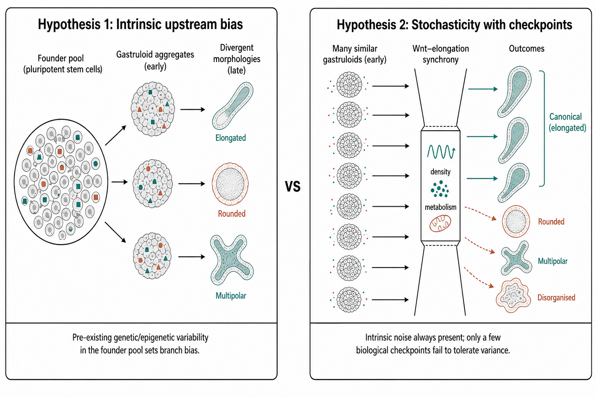
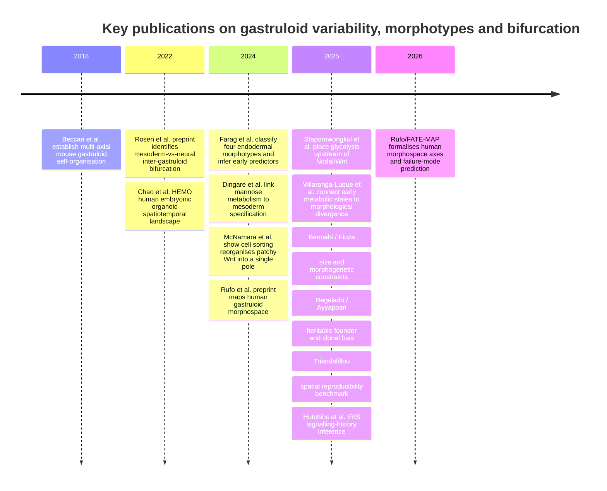

## List of gastruloid datasets {#sec-datasets}

@tbl-gastruloid-datasets catalogues published studies that generate or analyse
**mouse or human gastruloids** (or closely coupled trunk/TLS embryo models built
from the same aggregation protocols). Methodological reviews are included when
they focus on gastruloid variability and optimisation. Studies cited only for
general differential-expression statistics (e.g. DESeq2, MAST benchmarking) are
excluded.

Rows are drawn from `data/gastruloid_and_atlas_merged.csv` where
`catalogue == "gastruloid"`.

| Title | Authors | DOI | Year | Journal | Species | Study type | Bulk transcriptomics | Single-cell transcriptomics | Imaging | Spatial transcriptomics | Spatial proteomics | ChIP-seq | Metabolomics | Proteomics | Lineage barcoding | Time points (days) | Tissues | Summary | Public links |
| --- | --- | --- | ---: | --- | --- | --- | --- | --- | --- | --- | --- | --- | --- | --- | --- | --- | --- | --- | --- |
| Endogenous FGFs drive ERK-dependent cell fate patterning in 2D human gastruloids | Kyoung Jo; Zong-Yuan Liu | [10.1242/dev.205459](https://doi.org/10.1242/dev.205459) | 2026 | Development | Human | primary | ❌ | ✅ | ✅ | ❌ | ❌ | ❌ | ❌ | ❌ | ❌ | See article (2D gastruloid patterning time course) | Primitive streak; mesoderm | FGF–ERK signalling drives primitive-streak patterning in 2D human gastruloids. | https://doi.org/10.1242/dev.205459 |
| FATE-MAP predicts teratogenicity and human gastrulation failure modes by integrating deep learning and mechanistic modeling | Joseph Rufo; Chongxu Qiu | [10.1038/s41467-026-69596-6](https://doi.org/10.1038/s41467-026-69596-6) | 2026 | Nature Communications | Human | primary | ❌ | ❌ | ✅ | ❌ | ❌ | ❌ | ❌ | ❌ | ❌ | See article (2D gastruloid morphospace / perturbation screen) | Primitive streak; mesoderm; ectoderm/neural; endoderm (2D patterning) | FATE-MAP maps human 2D gastruloid morphospace; density-dependent Wnt and SOX2 stability as main axes. | https://doi.org/10.1038/s41467-026-69596-6; preprint 10.1101/2024.09.20.614192 |
| Lineage tracing in gastruloids to understand determinants of early fate decisions | Sung-Eun Park; Junhong Choi | [10.1016/j.gde.2026.102498](https://doi.org/10.1016/j.gde.2026.102498) | 2026 | Current Opinion in Genetics & Development | Mouse / gastruloid models | review | ❌ | ❌ | ❌ | ❌ | ❌ | ❌ | ❌ | ❌ | ✅ | — | Early fate decisions; germ layers (review scope) | Review of lineage tracing in gastruloids and interplay of fate with signalling. | https://doi.org/10.1016/j.gde.2026.102498 |
| Minimal essential requirements for neural tube self-organisation | Hannah T. Stuart; Elena Costantini | [10.64898/2026.06.06.730555](https://doi.org/10.64898/2026.06.06.730555) | 2026 | bioRxiv (preprint) | Mouse / stem-cell models | primary | ❌ | ✅ | ✅ | ❌ | ❌ | ❌ | ❌ | ❌ | ❌ | See preprint (neural-tube organoid time course) | Neural tube; neural | Neural tube organoids self-organise via RA-driven cellular diversity and morphogen patterning. | https://doi.org/10.64898/2026.06.06.730555 |
| The proteomic landscape and temporal dynamics of human and mouse gastruloid development | Riddhiman K. Garge; Devin K. Schweppe | [10.1038/s41556-026-01937-5](https://doi.org/10.1038/s41556-026-01937-5) | 2026 | Nature Cell Biology | Mouse + human | primary | ✅ | ❌ | ❌ | ❌ | ❌ | ❌ | ❌ | ✅ | ❌ | ~4 stages (matched mouse/human gastruloid time course) | Germ layers; axial development; global lineage-stage programmes | Matched temporal proteome, phosphoproteome and transcriptome dynamics in mouse and human gastruloids. | GEO GSE273813; ProteomeXchange/PRIDE |
| Using CRISPR barcoding as a molecular clock to capture dynamic processes at single-cell resolution | Yolanda Andres-Lopez; Alice Santambrogio | [10.1101/gr.280915.125](https://doi.org/10.1101/gr.280915.125) | 2026 | Genome Research | Mouse | primary | ❌ | ✅ | ❌ | ❌ | ❌ | ❌ | ❌ | ❌ | ✅ | See article (gastruloid state-transition time course) | Mesoderm; neural; multipotent progenitors | CRISPR barcoding with transcriptomics tracks cell-state transitions in mouse gastruloids. | https://doi.org/10.1101/gr.280915.125 |
| An inducible model of human post-implantation development derived from primed and naive stem cells | Seiya Oura; Leijie Li | [10.1016/j.stem.2025.08.005](https://doi.org/10.1016/j.stem.2025.08.005) | 2025 | Cell Stem Cell | Human | primary | ❌ | ✅ | ✅ | ❌ | ❌ | ❌ | ❌ | ❌ | ❌ | Post-implantation to ~CS5–6 (see article) | Epiblast; germ layers; post-implantation embryo model | Inducible stem-cell embryo models recapitulate human post-implantation development to CS5–6. | https://doi.org/10.1016/j.stem.2025.08.005 |
| Barcoded monoclonal embryoids are a potential solution to confounding bottlenecks in mosaic organoid screens | Samuel G. Regalado; Chengxiang Qiu | [10.1101/2025.05.23.655669](https://doi.org/10.1101/2025.05.23.655669) | 2025 | bioRxiv (preprint) | Mouse | primary | ❌ | ✅ | ❌ | ❌ | ❌ | ❌ | ❌ | ❌ | ✅ | See preprint (mosaic embryoid screen) | Embryoid body; multipotent / germ-layer progenitors | CRISPR TF screen in mosaic embryoid bodies using scRNA-seq and barcoding. | https://doi.org/10.1101/2025.05.23.655669 |
| Establishment of Human Gastrulating Stem Cells with the Capacity of Stable Differentiation into Multiple Gastrulating Cell Types | Mingqian Huang; Jing Sha | [10.1038/s41422-025-01146-z](https://doi.org/10.1038/s41422-025-01146-z) | 2025 | Cell Research | Human | primary | ❌ | ✅ | ✅ | ❌ | ❌ | ❌ | ❌ | ❌ | ❌ | Multiple (derivation and differentiation assays) | Mesendoderm; ectoderm/neural; mesoderm; endoderm | Stable human gastrulating stem cells differentiating into multiple gastrulation-like lineages. | GEO/SRA in data availability |
| Extended culture of 2D gastruloids to model human mesoderm development | Bohan Chen; Hina Khan | [10.1038/s41592-025-02669-4](https://doi.org/10.1038/s41592-025-02669-4) | 2025 | Nature Methods | Human | primary | ❌ | ❌ | ✅ | ❌ | ❌ | ❌ | ❌ | ❌ | ❌ | 0–10 (extended 2D culture to day 10) | Mesoderm | Extended 2D gastruloid culture protocol for reproducible human mesoderm modelling to day 10. | https://doi.org/10.1038/s41592-025-02669-4 |
| Gastruloid patterning reflects division of labor among biased stem cell clones | Vinay Ayyappan; Arjun Raj | [10.1101/2025.07.12.664536](https://doi.org/10.1101/2025.07.12.664536) | 2025 | bioRxiv / PMC preprint | Mouse | primary | ❌ | ❌ | ✅ | ✅ | ❌ | ❌ | ❌ | ❌ | ✅ | ~5 (main endpoint ~120 h) | NMP/posterior; anterior/neural; mesoderm; endoderm | Clonal bias and clone mixing in robust A–P patterning (seqFISH marker panel). | Dropbox dataset; bioRxiv/PMC |
| Gastruloids enable modeling of the earliest stages of human cardiac and hepatic vascularization | Oscar J. Abilez; Joseph C. Wu | [10.1126/science.adu9375](https://doi.org/10.1126/science.adu9375) | 2025 | Science | Human | primary | ❌ | ✅ | ✅ | ❌ | ❌ | ❌ | ❌ | ❌ | ❌ | Multiple (gastruloid/vascular organoid induction time course) | Cardiac; endothelium/vascular; hepatic/endoderm; mesoderm | Models early human cardiac and hepatic vascularisation in gastruloid/vascular organoids. | GEO/SRA in article data availability |
| Glycolytic activity instructs germ layer proportions through regulation of Nodal and Wnt signaling | Kristina S. Stapornwongkul; Vikas Trivedi | [10.1016/j.stem.2025.03.011](https://doi.org/10.1016/j.stem.2025.03.011) | 2025 | Cell Stem Cell | Mouse + human | primary | ❌ | ✅ | ✅ | ❌ | ❌ | ❌ | ❌ | ❌ | ❌ | ~2–5 (~4 time points) | Primitive streak; mesoderm; endoderm; ectoderm | Glycolysis as upstream regulator of Nodal/Wnt/Fgf signalling and germ-layer proportions. | ENA PRJNA1186714; PMC12048219 |
| Integrated molecular-phenotypic profiling reveals metabolic control of morphological variation in a stem-cell-based embryo model | Alba Villaronga-Luque; Jesse V. Veenvliet | [10.1016/j.stem.2025.03.012](https://doi.org/10.1016/j.stem.2025.03.012) | 2025 | Cell Stem Cell | Mouse | primary | ❌ | ✅ | ✅ | ❌ | ❌ | ❌ | ✅ | ❌ | ❌ | 2–5 (48–120 h; TLS at 120 h) | Mesoderm; trunk-like lineages; gastruloid/TLS cell states | Links molecular, imaging and metabolic phenotypes to morphological variation in gastruloids/TLS. | GEO GSE250136 |
| Lineage recording in monoclonal gastruloids reveals heritable modes of early development | Samuel G. Regalado; Chengxiang Qiu | [10.1101/2025.05.23.655664](https://doi.org/10.1101/2025.05.23.655664) | 2025 | bioRxiv (preprint) | Mouse | primary | ❌ | ✅ | ❌ | ❌ | ❌ | ❌ | ❌ | ❌ | ✅ | See preprint (monoclonal gastruloid + lineage recording) | Mesoderm; neural; multipotent progenitors | DNA Typewriter lineage recording in monoclonal gastruloids shows heritable founder mESC state biases. | https://doi.org/10.1101/2025.05.23.655664; PMC12139830 |
| Marangoni-like tissue flows enhance symmetry breaking of embryonic organoids | Simon Gsell; Pierre-François Lenne | [10.1038/s41567-025-02802-2](https://doi.org/10.1038/s41567-025-02802-2) | 2025 | Nature Physics | Mouse | primary | ❌ | ❌ | ✅ | ❌ | ❌ | ❌ | ❌ | ❌ | ❌ | ~2–4 (live imaging across early symmetry-breaking) | Posterior/symmetry-breaking domain; endoderm-like region | Tissue-scale Marangoni-like flows promote symmetry breaking in gastruloids. | Nature Physics supplementary movies/data |
| Modelling co-development between the somites and neural tube in human trunk-like structures | Komal Makwana; Louise Tilley | [10.1038/s41556-025-01813-8](https://doi.org/10.1038/s41556-025-01813-8) | 2025 | Nature Cell Biology | Human | primary | ❌ | ✅ | ✅ | ❌ | ❌ | ❌ | ❌ | ❌ | ❌ | See article (TLS co-development time course) | Somite; neural tube; mesoderm; neural | Human trunk-like structures model somite–neural-tube co-development via self-organised signalling. | https://doi.org/10.1038/s41556-025-01813-8 |
| Morphogenetic constraints in the development of gastruloids: Implications for mouse gastrulation | Ulla-Maj Fiuza; Sara Bonavia | [10.1016/j.cdev.2025.204043](https://doi.org/10.1016/j.cdev.2025.204043) | 2025 | Cells & Development | Mouse | primary | ❌ | ✅ | ✅ | ❌ | ❌ | ❌ | ❌ | ❌ | ❌ | See article (size and constraint regimes) | Germ layers; polarity/elongation domains | Morphogenetic constraints and size windows for robust gastruloid morphology vs transcription. | https://doi.org/10.1016/j.cdev.2025.204043 |
| N2B27 media formulations influence gastruloid development | Tina Balayo; Sharna Lunn | [10.1242/dev.204774](https://doi.org/10.1242/dev.204774) | 2025 | Development | Mouse | primary | ✅ | ❌ | ✅ | ❌ | ❌ | ❌ | ❌ | ❌ | ❌ | See article (N2B27 vs NDiff227 comparison) | Anterior/neural; paraxial mesoderm | Home-made N2B27 vs commercial NDiff227 media shift elongation timing and neural-vs-mesoderm bias. | https://doi.org/10.1242/dev.204774 |
| Non-cell-autonomous control of mouse gastruloid development by the ultra-conserved lncRNA T-UCstem1 | Arianna Coppola; Annalisa Fico | [10.1038/s44318-025-00558-2](https://doi.org/10.1038/s44318-025-00558-2) | 2025 | The EMBO Journal | Mouse | primary | ✅ | ✅ | ✅ | ❌ | ❌ | ❌ | ❌ | ❌ | ❌ | ~2–4 (~2–3 time points) | Pluripotent; mesoderm/posterior | lncRNA T-UCstem1 controls A–P extension and differentiation non-cell-autonomously. | GEO/SRA in article data availability |
| Reconstructing signaling histories of single cells via perturbation screens and transfer learning | Nicholas T. Hutchins; Miram Meziane | [10.1101/2025.03.16.643448](https://doi.org/10.1101/2025.03.16.643448) | 2025 | bioRxiv (preprint) | Human + mouse | primary | ❌ | ✅ | ❌ | ❌ | ❌ | ❌ | ❌ | ❌ | ❌ | Multi-day hESC combinatorial screens (d4–d8) + embryo atlas transfer | Primitive streak; mesoderm; endoderm; pluripotent | IRIS transfer-learning from combinatorial signalling screens to reconstruct single-cell signalling histories (hESC/mESC/embryo). | https://doi.org/10.1101/2025.03.16.643448 |
| Single-cell spatial mapping reveals reproducible cell type organization and spatially-dependent gene expression in gastruloids | Catherine G. Triandafillou; Arjun Raj | [10.1101/2025.07.14.664617](https://doi.org/10.1101/2025.07.14.664617) | 2025 | bioRxiv / PMC preprint | Mouse | primary | ❌ | ✅ | ✅ | ✅ | ❌ | ❌ | ❌ | ❌ | ❌ | ~5 (main endpoint ~120 h) | NMP; neural; mesoderm; somite; endoderm | seqFISH spatial single-cell maps of cell-type organisation in individual gastruloids. | bioRxiv/PMC; supplementary data |
| Size-dependent temporal decoupling of morphogenesis and transcriptional programs in pseudoembryos | Isma Bennabi; Thomas Gregor | [10.1126/sciadv.adv7790](https://doi.org/10.1126/sciadv.adv7790) | 2025 | Science Advances | Mouse | primary | ✅ | ✅ | ✅ | ❌ | ❌ | ❌ | ❌ | ❌ | ❌ | Multiple (size-series time courses) | Epiblast; primitive streak; mesoderm | Initial aggregate size decouples morphological vs transcriptional timing. | GEO GSE286428; GSE286273; ENA PRJNA1209118/PRJNA1208511/PRJNA1208519 |
| Stem cell culture conditions affect in vitro differentiation potential and mouse gastruloid formation | Marloes Blotenburg; Lianne Suurenbroek | [10.1371/journal.pone.0317309](https://doi.org/10.1371/journal.pone.0317309) | 2025 | PLOS ONE | Mouse | primary | ✅ | ✅ | ✅ | ❌ | ❌ | ❌ | ❌ | ❌ | ❌ | See article (pre-culture ESLIF/2i schedules) | Mesoderm; pluripotent; Brachyury timing | mESC pre-culture pluripotency/epigenetic state affects gastruloid reproducibility and lineage composition. | GEO GSE268783; GSE268814; GSE268816; https://doi.org/10.1371/journal.pone.0317309 |
| Cell-cell communication controls the timing of gastruloid symmetry-breaking | David Oriola; Vikas Trivedi | [10.1101/2024.12.16.628776](https://doi.org/10.1101/2024.12.16.628776) | 2024 | bioRxiv | Mouse | primary | ❌ | ✅ | ✅ | ❌ | ❌ | ❌ | ❌ | ❌ | ❌ | ~0–2 (~3 early time points) | Posterior/mesoderm (T+); pluripotent-like; anterior-like | Cell–cell communication and feedback control timing of T/Brachyury symmetry breaking. | ArrayExpress E-MTAB-12749; GitHub/DockerHub analysis resources |
| Coordination between endoderm progression and mouse gastruloid elongation controls endodermal morphotype choice | Naama Farag; Iftach Nachman | [10.1016/j.devcel.2024.05.017](https://doi.org/10.1016/j.devcel.2024.05.017) | 2024 | Developmental Cell | Mouse | primary | ❌ | ❌ | ✅ | ❌ | ❌ | ❌ | ❌ | ❌ | ❌ | 2–4 (48–96 h live imaging) | Endoderm; mesoderm | Live imaging + ML to predict and steer definitive endoderm morphotype variability. | Zenodo 10.5281/zenodo.13928013 |
| Deciphering lineage specification during early embryogenesis in mouse gastruloids using multilayered proteomics | Suzan Stelloo; Michiel Vermeulen | [10.1016/j.stem.2024.04.017](https://doi.org/10.1016/j.stem.2024.04.017) | 2024 | Cell Stem Cell | Mouse + human validation | primary | ✅ | ✅ | ✅ | ❌ | ❌ | ✅ | ❌ | ✅ | ❌ | ~5 matched gastruloid (+ embryo) stages | Mesoderm; PSM/somite; NMP; ectoderm; endoderm | Proteome/phosphoproteome dynamics and regulators (e.g. ZEB2) of lineage specification. | GEO GSE229029; PRIDE PXD041309/PXD041328/PXD048347 |
| Early autonomous patterning of the anteroposterior axis in gastruloids | Kerim Anlaş; Vikas Trivedi | [10.1242/dev.202171](https://doi.org/10.1242/dev.202171) | 2024 | Development | Mouse | primary | ❌ | ✅ | ✅ | ❌ | ❌ | ❌ | ❌ | ❌ | ❌ | ~0–2 (~4 early time points) | Pluripotent; primitive streak; mesendoderm; anterior/posterior | Early autonomous A–P patterning and cell-state emergence. | ArrayExpress E-MTAB-12749 |
| Gastruloids are competent to specify both cardiac and skeletal muscle lineages | Laurent Argiro; Fabienne Lescroart | [10.1038/s41467-024-54466-w](https://doi.org/10.1038/s41467-024-54466-w) | 2024 | Nature Communications | Mouse | primary | ❌ | ✅ | ✅ | ❌ | ❌ | ❌ | ❌ | ❌ | ❌ | ~0–11 (~6 sampled points to day 11) | Cardiac; skeletal muscle; endothelium; endoderm; ectoderm; mesenchyme | Cardiopharyngeal, cardiac, skeletal muscle and endothelial trajectories in gastruloids. | GEO GSE232773; Zenodo 10.5281/zenodo.14188076 |
| Mannose controls mesoderm specification and symmetry breaking in mouse gastruloids | Chaitanya Dingare; Benjamin Steventon | [10.1016/j.devcel.2024.03.031](https://doi.org/10.1016/j.devcel.2024.03.031) | 2024 | Developmental Cell | Mouse | primary | ❌ | ❌ | ✅ | ❌ | ❌ | ❌ | ✅ | ✅ | ❌ | ~2–5 (~4 time points) | Mesoderm; posterior elongation | Mannose and 2-DG affect mesoderm specification, glycosylation and axial elongation. | Metabolomics Workbench; Dev Cell supplementary data |
| Reconstructing axial progenitor field dynamics in mouse stem cell-derived embryoids | Adriano Bolondi; Michelle M. Chan | [10.1016/j.devcel.2024.03.024](https://doi.org/10.1016/j.devcel.2024.03.024) | 2024 | Developmental Cell | Mouse | primary | ❌ | ✅ | ✅ | ❌ | ❌ | ❌ | ❌ | ❌ | ✅ | ~4 (trunk embryoid time course) | NMP; neural; somitic/axial progenitors | Cas9 molecular recording of NMP fate dynamics in trunk embryoids. | Dev Cell supplementary data |
| Recording morphogen signals reveals mechanisms underlying gastruloid symmetry breaking | Harold M. McNamara; Jared E. Toettcher | [10.1038/s41556-024-01521-9](https://doi.org/10.1038/s41556-024-01521-9) | 2024 | Nature Cell Biology | Mouse | primary | ❌ | ✅ | ✅ | ❌ | ❌ | ❌ | ❌ | ❌ | ❌ | ~2–4 (~4 time points) | Posterior/NMP-like; anterior; BMP/Nodal-recorded populations | Synthetic recorders link early Nodal/BMP/Wnt histories to later A–P organisation. | PMC/source supplementary data |
| Control of gastruloid patterning and morphogenesis by the Erk and Akt signaling pathways | Evan J. Underhill; Jared E. Toettcher | [10.1242/dev.201663](https://doi.org/10.1242/dev.201663) | 2023 | Development | Mouse | primary | ❌ | ❌ | ✅ | ❌ | ❌ | ❌ | ❌ | ❌ | ❌ | ~2–4 (~3 time points) | Presomitic mesoderm; precardiac mesoderm; anterior/posterior mesoderm | Erk and Akt gradients control morphogenesis, proliferation and mesodermal fate allocation. | Addgene 207328–207329; Development supplementary data |
| Gastruloid optimization | Lara Avni; Iftach Nachman | [10.1042/etls20230096](https://doi.org/10.1042/etls20230096) | 2023 | Emerging Topics in Life Sciences | Mouse | review | ❌ | ❌ | ❌ | ❌ | ❌ | ❌ | ❌ | ❌ | ❌ | — | Germ layers; endoderm morphotypes (conceptual) | Review of gastruloid variability and strategies to reduce morphogenetic divergence. | PMC10754328 |
| Multimodal characterization of murine gastruloid development | Simon Suppinger; Prisca Liberali | [10.1016/j.stem.2023.04.018](https://doi.org/10.1016/j.stem.2023.04.018) | 2023 | Cell Stem Cell | Mouse | primary | ✅ | ✅ | ✅ | ❌ | ❌ | ❌ | ❌ | ❌ | ❌ | 0–5 (~0–120 h; ~5 time points) | Epiblast/pluripotent; primitive streak; mesoderm; neuroectoderm; endoderm | Multimodal reference of gastruloid development and symmetry breaking. | GEO GSE229513 / GSE229386; GitHub |
| Cell-state transitions and collective cell movement generate an endoderm-like region in gastruloids | Ali Hashmi; Pierre-François Lenne | [10.7554/eLife.59371](https://doi.org/10.7554/eLife.59371) | 2022 | eLife | Mouse | primary | ❌ | ❌ | ✅ | ❌ | ❌ | ❌ | ❌ | ❌ | ❌ | ~2–4 (~3 time points) | Endoderm-like; posterior/mesoderm-like | Endoderm-like region emerges via cell-state transitions and collective movement. | eLife figures/data; PMC |
| Inter-gastruloid heterogeneity revealed by single cell transcriptomics time course: implications for organoid based perturbation studies | Leah U. Rosen; L. Carine Stapel | [10.1101/2022.09.27.509783](https://doi.org/10.1101/2022.09.27.509783) | 2022 | bioRxiv (preprint) | Mouse | primary | ❌ | ✅ | ❌ | ❌ | ❌ | ❌ | ❌ | ❌ | ❌ | 3–5 (~half-day intervals) | Mesoderm/somitic; neural/ectoderm | Individual-gastruloid MULTI-seq scRNA-seq reveals early mesoderm-vs-neural inter-gastruloid bifurcation linked to Wnt activity. | GEO GSE212050; PRJNA873702; https://doi.org/10.1101/2022.09.27.509783 |
| Organoid-based single-cell spatiotemporal gene expression landscape of human embryonic development and hematopoiesis | Yiming Chao; Yang Xiang | [10.1101/2022.09.02.505700](https://doi.org/10.1101/2022.09.02.505700) | 2022 | bioRxiv (preprint) | Human | primary | ❌ | ✅ | ❌ | ✅ | ❌ | ❌ | ❌ | ❌ | ❌ | ~8–18 (HEMO D8/D15/D18) | Extraembryonic trophoblast-like; yolk sac; neural crest; cardiac mesoderm; haematopoietic | Human embryonic organoid (HEMO) spatiotemporal scRNA-seq + Visium landscape of embryonic and haematopoietic lineages. | https://doi.org/10.1101/2022.09.02.505700 |
| Capturing cardiogenesis in gastruloids | Gioele Rossi; Matthias P. Lutolf | [10.1016/j.stem.2020.10.013](https://doi.org/10.1016/j.stem.2020.10.013) | 2021 | Cell Stem Cell | Mouse | primary | ❌ | ✅ | ✅ | ❌ | ❌ | ❌ | ❌ | ❌ | ❌ | Multiple (cardiac gastruloid protocol time course) | Cardiac; endothelium; mesoderm; neural-associated | Modified gastruloid conditions to capture early cardiac specification and beating regions. | GEO/SRA in data availability |
| Mouse embryonic stem cells self-organize into trunk-like structures with neural tube and somites | Jesse V. Veenvliet; Bernhard G. Herrmann | [10.1126/science.aba4937](https://doi.org/10.1126/science.aba4937) | 2020 | Science | Mouse | primary | ❌ | ✅ | ✅ | ❌ | ❌ | ❌ | ❌ | ❌ | ❌ | Multiple (~4–5 culture days for TLS induction) | NMP; neural tube; somite; endoderm; trunk mesoderm | TLS with neural tube and somite-like compartments from gastruloid-related aggregates. | Science supplementary data; sequencing resources |
| Multi-axial self-organization properties of mouse embryonic stem cells into gastruloids | Leonardo Beccari; Alfonso Martinez Arias | [10.1038/s41586-018-0578-0](https://doi.org/10.1038/s41586-018-0578-0) | 2018 | Nature | Mouse | primary | ❌ | ❌ | ✅ | ❌ | ❌ | ❌ | ❌ | ❌ | ❌ | Several (aggregation and CHIR-timed morphogenesis) | Primitive streak-like; mesoderm; neural-like; somitic/axial | Foundational demonstration of multi-axial self-organisation in mouse gastruloids. | Nature supplementary data; GSE106227 (gastruloids); GSE113885 (embryo RNA-seq) |

: Published gastruloid and related embryo-model datasets {#tbl-gastruloid-datasets}

# Morphotypes, phenotypic landscapes, and trajectory bifurcation {#sec-bifurcation}

The narrative below synthesises variability and bifurcation studies that appear
in @tbl-gastruloid-datasets. Comparative summaries are in @tbl-core-bifurcation
and @tbl-adjacent-bifurcation; the conceptual map is @eq-bifurcation-map and
@fig-two-hypotheses.

## Executive summary

The literature that directly targets **divergent outcomes emerging from nominally similar gastruloid starts** is still smaller than the broader gastruloid field, but it is now substantial enough to reveal a coherent picture. The strongest mouse study for this question is **Villaronga-Luque et al.** [@villaronga2025], because it links **individual morphological histories**, **time-resolved single-cell transcriptomes**, and **metabolic state** to later phenotypic divergence, and then tests causality by metabolic intervention. The key claim is that **early oxidative phosphorylation–glycolysis imbalance precedes and drives later aberrant morphology with a neural lineage bias**. Data are available at **GEO GSE250136**, with imaging and analysis deposits.

Across the direct and adjacent literature, proposed drivers of bifurcation fall into four recurring classes (@tbl-core-bifurcation; @tbl-adjacent-bifurcation):

1. **Metabolic state** — Luque, Dingare, Stapornwongkul [@villaronga2025; @dingare2024; @stapornwongkul2025].
2. **Signalling-state dynamics** (especially Wnt/Nodal/SOX2) — Rosen, Rufo, McNamara, Underhill [@rosen2022; @rufo2026; @mcnamara2024; @underhill2023].
3. **Physical or morphogenetic initial conditions** (density, size, elongation–lineage coordination) — Rufo, Bennabi, Fiuza, Farag [@rufo2026; @bennabi2025; @fiuza2025; @farag2024].
4. **Heritable founder-cell or clone bias** — Regalado, Ayyappan, and pre-culture epigenetic memory in Blotenburg [@regalado2025; @ayyappan2025; @blotenburg2025].

**No single paper yet closes the full causal chain** from founder-cell state, through live signalling and metabolism, to 3D morphogenetic divergence and terminal morphotype in the same individual gastruloids. **Luque comes closest**; Farag is strongest on **explicit morphotype classification**; Rufo on **phenotypic morphospace**; Regalado and Ayyappan on **intrinsic, heritable bias** [@villaronga2025; @farag2024; @rufo2026; @regalado2025; @ayyappan2025].

The highest-priority next step is a **prospective, single-gastruloid, multimodal bifurcation experiment** combining Luque-style paired morphology/molecular design with **lineage recording**, **live Wnt/Nodal/ERK reporters**, and systematic perturbation of **metabolism, density and size**, so relative causal weights and interactions can be estimated **before** visible divergence [@villaronga2025; @regalado2025; @rufo2026; @bennabi2025].

## Scope and inclusion logic

Here **“morphotype”** includes discrete morphological classes, structured regions of a low-dimensional phenotypic morphospace, and reproducible bifurcating trajectory classes that later produce distinct spatial or morphological outcomes. Papers were prioritised when their **main aim** was identifying morphotypes, mapping phenotypic landscapes, quantifying inter-gastruloid variability, defining failure modes, or testing drivers of divergent trajectories, ranked by closeness to **distinct outcomes from the same nominally naïve starting population**. Mechanistically informative papers that alter the start more strongly, or focus on patterning rather than divergence, are treated as adjacent.

The **Luque Villaronga** study remains the clearest attempt to join phenotype, dynamics, transcriptomics and metabolism in one framework [@villaronga2025]. Rufo exposes a human **12-cluster morphospace**; Farag a **decision-tree** for endodermal morphotypes; Luque the most reusable multi-modal entry point for reanalysis [@rufo2026; @farag2024; @villaronga2025].

## Prioritised literature

Read the field as a **core set** on divergence/morphotypes and a **second ring** of explanatory mechanism papers.

**Villaronga-Luque et al., *Cell Stem Cell* 2025** [@villaronga2025]. Mouse stem-cell embryo / TLS-like system; paired imaging, time-resolved scRNA-seq, metabolic interventions (**GSE250136**). Driver: early **OXPHOS–glycolysis imbalance** in NMP-like states predicting later neural-biased aberrant morphology. Evidence: **very strong** (time order + causal rescue). Limitation: final morphotype taxonomy needs full-text/data reanalysis.

**Farag et al., *Developmental Cell* 2024** [@farag2024]. Mouse gastruloids; live imaging; **500-tree** ensemble. **Four endodermal morphotypes** at 96 h, controlled by **coordination between endoderm progression and elongation**. Evidence: **very strong** for this sub-problem; limited to the endodermal branch.

**Rufo et al., *Nature Communications* 2026** (preprint 2024) [@rufo2026; @rufo2024preprint]. Human **2D** gastruloids; high-throughput perturbation; **12 clusters**; axes **cell-density-dependent Wnt** and **SOX2 stability**. Evidence: **very strong** morphospace map; limitation: 2D and largely perturbation-driven.

**Rosen et al., bioRxiv 2022** [@rosen2022]. Individual mouse gastruloids, MULTI-seq, days 3–5 (**GSE212050**). **Mesoderm- vs neural-biased** bifurcation with early **WNT-associated** activity difference. Evidence: **strongly suggestive**; correlative and preprint.

**Regalado et al., bioRxiv 2025** [@regalado2025]. Monoclonal gastruloids + **DNA Typewriter**. Heritable founder mESC state fluctuations bias trajectories. Evidence: **strong** on heritability; monoclonal design.

**Ayyappan et al., bioRxiv 2025** [@ayyappan2025]. Clonal propensities and **division of labour** among biased clones. Evidence: **strongly suggestive**; clone-centric.

**Triandafillou et al., bioRxiv 2025** [@triandafillou2025]. Spatial maps of **26** gastruloids; emphasises **reproducible organisation** (counterweight to heterogeneity narratives).

**Bennabi et al., *Science Advances* 2025** [@bennabi2025]. **System size** decouples morphogenetic timing from transcriptional programmes.

**Fiuza et al., *Cells & Development* 2025** [@fiuza2025]. **Mechanical/geometric constraints** and a robustness size window.

**Balayo et al., *Development* 2025** [@balayo2025]. Medium formulation (N2B27 vs NDiff227) shifts elongation and neural-vs-mesoderm bias.

**Blotenburg et al., *PLOS ONE* 2025** [@blotenburg2025]. Pre-culture pluripotency/epigenetic memory alters reproducibility and lineage composition.

**Chao et al., bioRxiv 2022** [@chao2022hemo]. Human embryonic organoid
(**HEMO**) with time-series scRNA-seq and Visium; models embryonic plus
extraembryonic/haematopoietic lineages (adjacent human 3D organoid atlas).

**Hutchins et al., bioRxiv 2025** [@hutchins2025iris]. **IRIS** transfer learning
from combinatorial signalling screens on hESCs to infer signalling histories in
embryo atlases (adjacent method for Wnt/Nodal/BMP-state inference).

**Adjacent mechanisms.** Dingare (mannose / Frzb glycosylation), Stapornwongkul (glycolysis → Nodal/Wnt), McNamara (Wnt recording and sorting), Underhill (ERK/Akt) [@dingare2024; @stapornwongkul2025; @mcnamara2024; @underhill2023].

## Comparative tables

| Priority | Paper | Status and DOI | Dataset and system | Assays | Computational approach | Main morphotypes or trajectory classes | Proposed drivers | Evidence strength and main limitation |
|---|---|---|---|---|---|---|---|---|
| Highest | Villaronga-Luque et al., 2025 | Peer-reviewed; 10.1016/j.stem.2025.03.012 | GSE250136; mouse stembryos / trunk formation | scRNA-seq, imaging, metabolism, perturbations | Multi-modal integration; early→late prediction | Aberrant neural-biased vs successful trunk-like ends | Early OXPHOS–glycolysis imbalance | Strongest overall; taxonomy under-specified in abstract [@villaronga2025] |
| Highest | Farag et al., 2024 | Peer-reviewed; 10.1016/j.devcel.2024.05.017 | Mouse gastruloids; Zenodo/GitHub | Live imaging; interventions | 500-tree bootstrap ensemble | Four endodermal morphotypes at 96 h | Endoderm progression ↔ elongation | Very strong for endoderm branch [@farag2024] |
| Highest | Rufo et al., 2024/2026 | Final 10.1038/s41467-026-69596-6 | Human 2D gastruloids | Perturbation IF; live β-catenin | Morphospace clustering + morphogen model | 12 clusters; BRA/SOX2/symmetry failure modes | Density-dependent Wnt; SOX2 stability | Very strong landscape; 2D/perturbed [@rufo2026] |
| High | Rosen et al., 2022 | Preprint; 10.1101/2022.09.27.509783 | GSE212050; individual mouse gastruloids | MULTI-seq time course | Trajectory / gastruloid-level bias | Mesoderm- vs neural-biased | Early WNT-associated activity | Suggestive; correlative preprint [@rosen2022] |
| High | Regalado et al., 2025 | Preprint; 10.1101/2025.05.23.655664 | Monoclonal mouse gastruloids | scRNA-seq; DNA Typewriter | Lineage-tree reconstruction | Poor progress / meso / neural / rare types | Heritable founder-state fluctuations | Strong on heritability [@regalado2025] |
| High | Ayyappan et al., 2025 | Preprint; 10.1101/2025.07.12.664536 | Clonally traced mouse gastruloids | Lineage + spatial | Clone propensity maps | Anterior/posterior clone bias; mixing rescues | Division of labour among clones | Suggestive; clone-centric [@ayyappan2025] |
| Moderate | Triandafillou et al., 2025 | Preprint; 10.1101/2025.07.14.664617 | 26 individual gastruloids | Spatial sc mapping | Spatial atlas; L-metric | Emphasises reproducible organisation | Reproducibility benchmark | Counterpoint to strong bifurcation narratives [@triandafillou2025] |
| Moderate | Bennabi et al., 2025 | Peer-reviewed; 10.1126/sciadv.adv7790 | Size-perturbed mouse gastruloids | Live imaging; transcriptomics | Morphometric timing | Delayed SB; multipolarity; prolonged elongation | System size | Strong on route/timing [@bennabi2025] |
| Moderate | Fiuza et al., 2025 | Peer-reviewed; 10.1016/j.cdev.2025.204043 | Size/constraint regimes | Morphology; imaging; transcriptomics | Constraint analysis | Robust window outside which dynamics fail | Mechanical/geometric constraints | Moderate; broader framing [@fiuza2025] |

: Core studies on gastruloid divergence, morphotype and morphospace {#tbl-core-bifurcation}

| Priority | Paper | Status and DOI | Why it matters | Why it ranks lower |
|---|---|---|---|---|
| Moderate | Balayo et al., 2025 | 10.1242/dev.204774 | Medium formulation shifts elongation and neural-vs-mesoderm bias | Divergence induced by medium, weaker “same naïve start” [@balayo2025] |
| Moderate | Blotenburg et al., 2025 | 10.1371/journal.pone.0317309 | Pre-culture epigenetic/pluripotency state affects reproducibility | Intentional input-state shift before aggregation [@blotenburg2025] |
| Adjacent | Dingare et al., 2024 | 10.1016/j.devcel.2024.03.031 | Mannose / Frzb glycosylation and symmetry breaking | Mechanism, not morphotype map [@dingare2024] |
| Adjacent | Stapornwongkul et al., 2025 | 10.1016/j.stem.2025.03.011 | Glycolysis regulates Nodal/Wnt and germ-layer proportions | Driver paper, not morphotype-centred [@stapornwongkul2025] |
| Adjacent | McNamara et al., 2024 | 10.1038/s41556-024-01521-9 | Patchy Wnt rearranged into one pole by cell sorting | Symmetry breaking, not variability map [@mcnamara2024] |
| Adjacent | Underhill and Toettcher, 2023 | 10.1242/dev.201663 | ERK and Akt control size, shape and patterned expression | Not framed as bifurcation/morphospace [@underhill2023] |

| Adjacent | Chao et al., 2022 | 10.1101/2022.09.02.505700 | HEMO human embryonic organoid sc + spatial landscape | Not classical gastruloid; human haematopoietic/extraembryonic focus [@chao2022hemo] |
| Adjacent | Hutchins et al., 2025 | 10.1101/2025.03.16.643448 | IRIS signalling-history inference from perturbation atlases | Method paper; not morphotype classification [@hutchins2025iris] |

: Adjacent or less-strict matches to the naïve-start bifurcation criterion {#tbl-adjacent-bifurcation}

## Synthesis of drivers and disagreements

The field’s central disagreement is not whether divergence exists, but **where the dominant variance enters**. One group argues that the decisive step is **upstream and intrinsic**: Rosen (early Wnt-associated branch bias), Regalado (heritable founder states), Ayyappan (useful clonal propensities / division of labour) [@rosen2022; @regalado2025; @ayyappan2025]. A second group argues the decisive step is **state-dependent but extrinsically tuneable**: Luque (metabolism), Rufo (density/SOX2), Bennabi and Fiuza (size/constraint), Farag (elongation–lineage coordination) [@villaronga2025; @rufo2026; @bennabi2025; @fiuza2025; @farag2024]. These imply bifurcation through **multiple control layers**.

Empirically, **reproducibility versus heterogeneity** depends on the level measured: broad tissue classes can look reproducible [@beccari2018; @triandafillou2025] while lineage proportions, timing, polarity and terminal morphology still vary [@rosen2022; @villaronga2025; @regalado2025]. **Metabolism-centric** and **signalling-centric** accounts are best read as coupled: metabolism changes signalling competence, interpretation, or response thresholds [@villaronga2025; @dingare2024; @stapornwongkul2025; @rufo2026; @rosen2022; @mcnamara2024; @underhill2023].

A conspicuous gap remains in **human 3D** systems: Rufo/FATE-MAP is strong in 2D human morphospace, but Luque- or Farag-depth longitudinal 3D bifurcation maps are still largely mouse [@rufo2026; @villaronga2025; @farag2024].

### Two working hypotheses

Formally, let $X_0$ be the founder-pool state (genetic/epigenetic/clonal composition), $\varepsilon_t$ intrinsic developmental noise (as in embryos), and $C_t$ a vector of **checkpoints** (e.g. Wnt induction synchronised with elongation and spatial patterning). Then morphotype $M$ can be written schematically as

$$
M = f\!\bigl(X_0,\; \varepsilon_{0:T},\; C_{0:T}\bigr)
$$ {#eq-bifurcation-map}

**Hypothesis 1 (intrinsic upstream bias)** emphasises variation in $X_0$: pre-existing mutations and/or epigenetic variability in the gastruloid founder pool set branch bias before aggregation or early patterning [@regalado2025; @ayyappan2025; @rosen2022; @blotenburg2025].

**Hypothesis 2 (stochasticity with intolerant checkpoints)** emphasises that $\varepsilon_t$ is always present, but only a **small subset of biological conditions** $C_t$ fails to buffer that variance—for example synchronisation of Wnt induction with elongation and spatial development [@farag2024; @rufo2026; @bennabi2025; @mcnamara2024; @villaronga2025].

@fig-two-hypotheses summarises this contrast.

{#fig-two-hypotheses}

## Recommended next experiments and analyses

1. **Luque-plus-lineage** — pair morphology/molecular histories with Regalado-style lineage recording to test whether early metabolic predictors sit in founder lineages or arise post-aggregation [@villaronga2025; @regalado2025].
2. **Factorial perturbation map** — cross size, density, glucose/mannose, and Wnt/Nodal/SOX2 [@rufo2026; @villaronga2025; @bennabi2025; @fiuza2025; @stapornwongkul2025; @dingare2024; @farag2024].
3. **Continuous early live reporters** in 3D (Wnt, Nodal, ERK) to classify on signalling-trajectory features before morphology diverges [@rufo2026; @mcnamara2024; @rosen2022; @villaronga2025].
4. **Discrete-basin versus continuum** reanalysis of GSE250136 + imaging [@villaronga2025].
5. **Cross-dataset integration** of Luque, Rosen and Triandafillou [@villaronga2025; @rosen2022; @triandafillou2025].
6. **Bifurcation benchmarking standards** (size/density distributions, pre-culture, CHIR timing, individual outcome frequencies) informed by Balayo and Blotenburg [@balayo2025; @blotenburg2025].

## Timeline of key publications

These prioritised studies are also rows in @tbl-gastruloid-datasets above
(including newly catalogued HEMO [@chao2022hemo] and IRIS signalling-history
[@hutchins2025iris] resources). Public access points cited in the source list
include GEO **GSE250136** / **GSE212050**, Farag/SUMO code
(<https://supervised-morphogenesis.eu/index.php/code/>), FATE-MAP
[@rufo2026], McNamara [@mcnamara2024], Raj lab spatial/clonal preprints
[@ayyappan2025; @triandafillou2025], Bennabi [@bennabi2025], Balayo
[@balayo2025], Underhill [@underhill2023], Blotenburg [@blotenburg2025],
Dingare [@dingare2024], and Beccari embryo/gastruloid GEO accessions
**GSE113885** / **GSE106227** [@beccari2018].

## References
